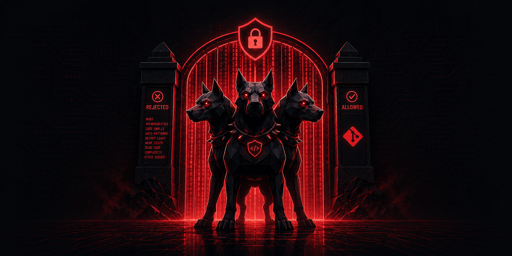

# Cerberus

### The three-headed gate that guards your repo from AI slop.



Your AI agent writes code at 5,000 lines a diff.
Some of it is brilliant.
Some of it is slop: a leaked key, an `any`, an N+1, a `catch {}` that swallows the bug.
You can't review it all by hand.
Cerberus stands at the gate: every commit walks past three heads (**quality**, **security**, and **AI anti-patterns**), and the slop never makes it through.

Cerberus is a **deterministic pre-commit gate** for AI-agent-generated **TypeScript, JavaScript, and Python**.
No LLM in the loop, just fast, repeatable analysis that an agent can't talk its way past.

- **Deterministic, not vibes.** Real AST analysis and pattern matching, not an LLM grading an LLM. The same diff always gets the same verdict.
- **Delta, not absolute.** Measures only the **files you touch** against a baseline, so legacy debt is grandfathered and you're never forced into a big refactor.
- **Security tier is non-bypassable.** Secret leaks, injection sinks, unsafe migrations, and slopsquatted deps always run, even when quality checks are skipped. Local hooks are advisory (`--no-verify` exists); the CI gate (`check --base`) is the hard enforcement point that `--no-verify` can't reach.
- **Built for the agent loop.** Pairs with any push-time orchestrator: Cerberus is the verifier that decides pass/fail, the orchestrator drives the fix.

> **Heads up:** formerly `code-quality-gate`. Renamed with full backward compatibility: the old binary (`quality-gate`), config (`.quality-gate.json`), presets (`@quality-gate/*`), suppress comments (`// quality-gate-allow:`), and `QUALITY_GATE_BYPASS` all still work as aliases.

Canonical names: binary `cerberus`, config `.cerberus.json`, baseline `.cerberus-baseline.json`, presets `@cerberus/{nextjs,monorepo-turborepo,node-cli}`, suppress `// cerberus-allow: <rule>`, bypass `CERBERUS_BYPASS=1` / `[skip-cerberus]`.

MIT licensed. See [LICENSE](./LICENSE).

## The three heads

Every staged file walks past three kinds of check before it can land:

- **Quality.** Cognitive and cyclomatic complexity, function length, parameter count, duplication, shallow modules, coverage drift.
- **Security** *(non-bypassable)*. Leaked secrets, injection sinks, unsafe SQL migrations, slopsquatted dependencies.
- **AI anti-patterns.** `catch {}` that swallows errors, hallucinated imports, N+1 queries, missing transactions/revalidation.

17 analyzers in total, for **TypeScript, JavaScript, and Python**.
Full list, limits, and design notes: **[docs/analyzers.md](./docs/analyzers.md)**.

## How it works

- **Delta, not absolute.** `cerberus baseline` snapshots current metrics; the gate only blocks when a touched file gets *worse* than its baseline. Legacy debt is grandfathered.
- **Anti-doom-loop.** After repeated failed commits on the same files, the gate lets the commit through and injects `// TODO: cerberus(...)` flags so the debt is tracked instead of looping forever. **Quality violations only; security never passes.**
- **One CLI, four triggers.** A Claude Code edit hook for instant feedback, a git `pre-commit` hook, an agent-`git commit` guard, and `check --base <ref>` as the PR-blocking gate in CI.

## Quickstart

Cerberus is distributed as a **git dependency** (not on npm — the bare `cerberus` name there is an unrelated package), so install it from GitHub and run it through your package manager:

```bash
# 1. Add Cerberus (prebuilt dist is committed — no build step)
pnpm add -D github:alissonrgalindo/cerberus#v0.4.0

# 2. Pick a preset
echo '{ "extends": "@cerberus/nextjs" }' > .cerberus.json

# 3. Snapshot the current state as the floor
pnpm exec cerberus baseline

# 4. Install the git + Claude Code hooks
pnpm exec cerberus install-hooks

# 5. Commit as usual; the gate runs automatically
git commit -m "..."
```

Or, in Claude Code, install the plugin instead: `/plugin install code-quality-gate`.

## Docs

- **[Analyzers](./docs/analyzers.md)**: every check, its limit, and why it exists.
- **[Configuration & CLI](./docs/configuration.md)**: config file, presets, commands, hooks, bypasses, troubleshooting.
- **[CI, security tier & languages](./docs/ci-and-languages.md)**: PR enforcement, the non-bypassable security tier, Python and JavaScript support.
- **[Install guide](./INSTALL.md)**: full setup including CI and agent rules.

## Requirements

Node 20+, a git repository, and (optionally) `vitest` for the coverage analyzer.

## License

[MIT](./LICENSE).
